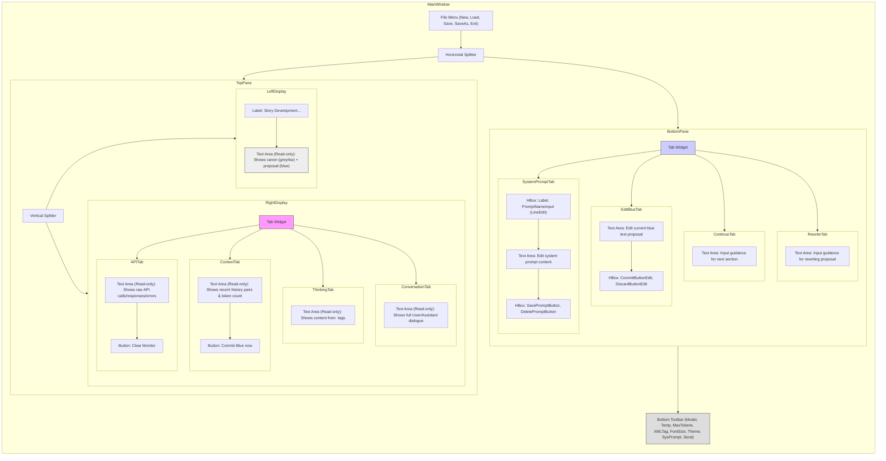

# Narrative Collaboration System ([TINS Edition](https://ThereIsNoSource.com))

<!-- Zero Source Specification v1.0 -->
<!-- ZS:PLATFORM:DESKTOP -->
<!-- ZS:LANGUAGE:PYTHON -->
<!-- ZS:GUI_TOOLKIT:QT_COMPATIBLE --> <!-- Suggests Qt, allows flexibility (PySide/PyQt) -->
<!-- ZS:LLM_INTEGRATION:GROQ -->
<!-- ZS:FRAMEWORK:LANGCHAIN --> <!-- Indicates reliance on Langchain concepts -->

## Description

The Narrative Collaboration System is a desktop application designed to facilitate creative writing in partnership with a Large Language Model (LLM) provided by Groq. Users interact with the AI to generate narrative content, manage story progression through a proposal/commit system, customize AI behavior via system prompts, and monitor the underlying LLM interactions. The application aims to provide a seamless environment for AI-assisted storytelling, focusing solely on narrative output without meta-commentary from the AI.

## Functionality

### Core Features

*   **AI Narrative Generation:** Interact with a configured Groq LLM to generate story content based on user input and conversation history.
*   **Story Management:**
    *   Maintain a validated story history ("canon," displayed in black/white or grey).
    *   Display the latest AI-generated or user-edited continuation as a "proposal" ("blue text").
    *   Commit the current blue text proposal to the canon.
    *   Discard the current blue text proposal and revert to the last committed state.
*   **Conversation History:**
    *   Maintain a conversation history within a configurable token limit.
    *   Implement a dual-state memory (proposal/committed) for managing commits and discards.
    *   Display the conversation history used as context for the LLM.
*   **System Prompt Management:**
    *   Use customizable system prompts to guide the AI's persona and behavior.
    *   Load, save, select, and delete named system prompts.
    *   Store system prompts persistently (e.g., in a JSON file).
    *   Default prompt focuses on narrative-only, publication-ready output.
*   **LLM Configuration:**
    *   Select the Groq LLM model to use.
    *   Adjust LLM temperature for creativity vs. coherence.
    *   Set maximum tokens for the LLM response generation.
    *   (Implicit) Set maximum tokens for the context window history.
*   **User Input Flexibility:**
    *   Provide input via different modes: editing the current proposal, providing continuation guidance, or providing rewrite guidance.
    *   Optionally wrap user input with custom XML tags.
*   **Monitoring:**
    *   Display the AI's internal "thinking" process (extracted from `<think>` tags in the raw response).
    *   Log the full conversation history, including user inputs and raw AI responses (with thinking tags).
    *   Monitor raw API requests and responses to/from the Groq API, including errors.
*   **Persistence:**
    *   Load stories from text files.
    *   Save the validated story canon to text files ("Save", "Save As").
    *   Create new, empty stories.
    *   Handle unsaved changes (blue text proposal) before loading/clearing.
*   **API Key Management:**
    *   Prompt the user for a Groq API key on first launch if not found.
    *   Provide instructions and links for obtaining a key.
    *   Validate key format (prefix `gsk_`, length 56) with a warning if mismatched.
    *   Store the API key securely in a `.env` file.
*   **UI Customization:**
    *   Toggle between dark and light themes.
    *   Adjust the font size for main text areas.

### User Interface (UI)

The application utilizes a multi-pane desktop interface, preferably implemented using a Qt-compatible framework (like PySide6 or PyQt).



*   **MenuBar:** Standard application menu for file operations.
*   **Toolbar:** Located at the bottom, provides quick access to LLM parameters, UI settings, system prompt selection, and the main Send action.
*   **Story Display:** Read-only area showing the committed story (canon) in a neutral color (e.g., grey/black/white) followed by the current uncommitted proposal (blue text). Placeholder text guides the user if empty.
*   **Monitor Tabs:**
    *   **Context:** Shows the actual message history (User/Assistant pairs) being sent to the LLM, along with token count relative to the limit. Includes a "Commit Blue now" button.
    *   **Thinking Process:** Displays content extracted from `<think>` tags in the AI's response. Placeholder explains its purpose.
    *   **Conversation Log:** Displays the full, unfiltered history of user inputs and AI responses, including thinking tags (visually distinct). Placeholder explains its purpose.
    *   **API Monitor:** Shows raw JSON requests/responses/errors for interactions with the Groq API. Includes a "Clear Monitor" button. Placeholder explains its purpose.
*   **Input Tabs:**
    *   **Edit Blue:** Allows direct editing of the current blue text proposal. Changes are reflected live in the Story Display. Contains "Commit Blue Now" and "Discard Blue Now" buttons. Placeholder explains usage.
    *   **Save Blue & Continue:** Commits the current blue text, then sends the text entered in this tab's input area (optional guidance) to the LLM to generate the *next* section. Placeholder explains usage.
    *   **Discard Blue & Rewrite:** Discards the current blue text, then sends the text entered in this tab's input area (rewrite guidance) to the LLM to generate a *new* proposal. Placeholder explains usage.
    *   **Customize System Prompt:** Allows viewing, editing, naming, saving, and deleting system prompts. Includes fields for prompt name and content, plus Save/Delete buttons.
*   **Send Button/Shortcut:** The primary action button (also triggered by Ctrl+Return/Enter) executes the logic based on the currently selected Input Tab.

### Behavior Specifications

*   **Initialization:**
    *   Check for `GROQ_API_KEY` in `.env`. If missing, show the `APIKeyDialog`.
    *   Load system prompts from `system_prompts.json` (or create default).
    *   Fetch available Groq models (fallback to defaults on error).
    *   Populate Model and System Prompt selectors in the toolbar.
    *   Set the active system prompt content in the "Customize System Prompt" tab.
    *   Initialize the Langchain/Groq LLM chain with the active prompt, selected model, and parameters.
    *   Initialize an empty story state or load from a file if specified.
*   **Sending Message (General):**
    *   Determine action based on the active Input Tab (Edit Blue (no send), Continue, Rewrite, System Prompt Save).
    *   If Continue or Rewrite, get guidance text from the respective input area.
    *   If XML tag is specified in the toolbar, wrap the guidance text.
    *   Invoke the LLM chain with the guidance text and current conversation history (managed by the memory component).
    *   Handle the LLM response:
        *   Extract narrative content (stripping `<think>` tags).
        *   Extract thinking content (from within `<think>` tags).
        *   Update the "blue text" proposal with the narrative content.
        *   Display thinking content in the "Thinking Process" monitor.
        *   Log user input and full AI response (with thinking tags) to "Conversation Log".
        *   Log raw API interaction to "API Monitor".
        *   Update the "Context" monitor display.
        *   Clear the input area of the sending tab (Continue/Rewrite).
*   **Tab-Specific Send Actions:**
    *   **Save Blue & Continue:** First, commit the current blue text proposal. Then, proceed with sending the guidance from the ContinueInput.
    *   **Discard Blue & Rewrite:** First, discard the current blue text proposal (revert memory state). Then, proceed with sending the guidance from the RewriteInput.
    *   **Customize System Prompt (Send Button Action):** Save the prompt name and content from the input fields using the `SystemPromptManager`, update the prompt selector, set the saved prompt as active, and re-initialize the LLM chain.
*   **Committing Blue Text:**
    *   Triggered by "Commit Blue now" buttons or implicitly by "Save Blue & Continue".
    *   Appends the `current_narrative` (blue text) to the `canon_validated` list.
    *   Clears the `current_narrative` (blue text becomes empty).
    *   Updates the Story Display (blue text disappears, added to canon).
    *   Commits the proposal state in the dual-state memory manager.
    *   Updates the Context Monitor.
*   **Discarding Blue Text:**
    *   Triggered by the "Discard Blue Now" button in the Edit Blue tab or implicitly by "Discard Blue & Rewrite".
    *   Discards the proposal state in the dual-state memory manager, restoring the last committed state.
    *   Updates the `current_narrative` (blue text) to reflect the last AI message from the *committed* history (if any).
    *   Updates the Story Display.
    *   Updates the Context Monitor.
*   **Editing Blue Text (Edit Blue Tab):**
    *   As the user types in the `edit_input` text area, the `current_narrative` state variable is updated in real-time.
    *   The Story Display updates live to show the user's edits in blue.
*   **Loading Story:**
    *   Prompt user to save/discard unsaved blue text if present.
    *   Show an open file dialog (filtering for `.txt`).
    *   Read the file content.
    *   Clear current canon and blue text.
    *   Split the loaded content into meaningful chunks (e.g., based on double newlines, minimum chunk size).
    *   Set the `canon_validated` list to these chunks *except* the last one (if any).
    *   Use the last chunk (or simulate interaction if no chunks) to prime the conversation history: Add simulated User/Assistant message pairs to the memory (up to context limit). The last chunk becomes the initial "blue text" proposal. *Correction*: The original code seems to add *all* chunks to canon and then simulates history from the last few chunks. Let's stick to the latter: All loaded content becomes canon. Simulate history using the last N chunks (e.g., up to 5 or token limit). No initial blue text unless history simulation results in one.
    *   Update Story Display and Context Monitor.
    *   Update window title.
*   **Saving Story:**
    *   If "Save As" or no current path, show save file dialog.
    *   Combine all strings in the `canon_validated` list with double newlines.
    *   Write the combined content to the selected file path.
    *   Update window title.
    *   (Implicit) Saving *does not* include the current blue text proposal unless explicitly committed first.
*   **New Story:**
    *   Prompt user to save/discard unsaved blue text if present.
    *   Clear canon, blue text, and conversation history.
    *   Reset file path.
    *   Update displays and window title.
*   **Parameter/Model/Prompt Changes:** When model, temperature, max tokens (LLM response), or active system prompt changes, re-initialize the LLM and conversation chain, preserving the current conversation history object.
*   **UI Updates:** Font size and theme changes should dynamically update the appearance of all relevant UI elements.

### API Key Management Flow

1.  On startup, check `os.getenv("GROQ_API_KEY")` after attempting `load_dotenv(".env")`.
2.  If the key is found and non-empty, proceed.
3.  If no key is found, display a modal dialog (`APIKeyDialog`).
4.  The dialog should explain the need for a key, provide a link to `console.groq.com/keys`, mention best practices, and have an input field and Save/Cancel buttons.
5.  On Save, retrieve the entered key.
6.  Validate the key format (starts with `gsk_`, length 56). If format mismatches, show a warning dialog asking the user if they want to proceed anyway.
7.  If validation passes or the user confirms proceeding despite the warning, save the key to the `.env` file (creating it if necessary) using `dotenv.set_key` and set it in the current environment `os.environ`. Close the dialog and proceed with initialization.
8.  If Cancel is clicked or the dialog is closed, exit the application gracefully.

## Technical Implementation

### Architecture

*   **GUI Layer:** Handles user interaction, displays information. Built with a Qt-compatible framework. (Corresponds to `gui.py`).
*   **Application Logic Layer:** Orchestrates UI events, manages application state, interacts with the LLM and managers. (Corresponds to `Narrative` class in `main.py`). This layer likely inherits from or composes the GUI Layer.
*   **LLM Interaction:** Uses Langchain core concepts (`RunnableWithMessageHistory`, `ChatPromptTemplate`, `MessagesPlaceholder`, `SystemMessage`, `HumanMessage`, `AIMessage`) and `langchain-groq` (`ChatGroq`) for communication with the Groq API.
*   **State Management:**
    *   `SystemPromptManager`: Manages loading, saving, deleting, and accessing system prompts from a JSON file (`system_prompts.json`).
    *   `TokenWindowDualStateMemory`: Custom Langchain `BaseChatMessageHistory` implementation managing the conversation history within a token limit, supporting proposal/commit/discard states.
*   **API Monitoring:** Uses a Langchain `BaseCallbackHandler` (`APIMonitorCallback`) to intercept LLM start/end/error/token events and log raw data.
*   **Configuration:** Uses `.env` file for API key, `system_prompts.json` for prompts.

### Data Structures / Models

*   **Story Content:**
    *   `canon_validated`: List of strings, where each string is a committed block of narrative.
    *   `current_narrative`: String representing the current blue text proposal.
*   **Conversation Message:** Adheres to Langchain `BaseMessage` structure (primarily `HumanMessage` and `AIMessage` containing a `content` string).
*   **System Prompt:** Dictionary structure within `system_prompts.json`:
    ```json
    {
      "active_prompt": "prompt_name",
      "prompts": {
        "prompt_name": {
          "content": "The actual system prompt text...",
          "created_at": "ISO8601_timestamp",
          "last_used": "ISO8601_timestamp"
        },
        // ... other prompts
      }
    }
    ```
*   **API Log Entry (Conceptual):** Timestamp, Type (Request/Response/Error), Content (JSON data or error message).

### Key Algorithms / Logic

*   **Token Window Dual State Memory:**
    *   Stores messages in two lists: `_messages_committed` and `_messages_proposal`.
    *   `messages` property returns the proposal list if `_has_pending_proposal` is true, otherwise the committed list.
    *   `add_message`: Appends to proposal list (creating it from committed if needed), then truncates based on tokens.
    *   `_truncate_messages`: Counts tokens (`tiktoken.encoding_for_model("gpt-3.5-turbo")` likely sufficient) from newest messages backward, keeping messages until `max_tokens` (e.g., 12000) is reached.
    *   `prepare_for_response`: Backs up the current active messages (proposal or committed) to `_messages_committed` before an LLM call. Sets `_has_pending_proposal` to false.
    *   `commit_proposal`: Copies `_messages_proposal` to `_messages_committed`. Sets `_has_pending_proposal` to false.
    *   `discard_proposal`: Copies `_messages_committed` back to `_messages_proposal`. Sets `_has_pending_proposal` to false.
*   **Response Parsing:** Use regular expressions (`re` module) to find and separate `<think>...</think>` blocks from the main narrative content in LLM responses. Handle multiline tags and surrounding whitespace.
*   **History Simulation (on Load):** Iterate through the last N chunks of the loaded canon. For each chunk, add a placeholder `HumanMessage` (e.g., content="✒️✍️📜") and an `AIMessage` with the chunk content to the history manager.
*   **Model Fetching:** Use the `groq` Python client (`Groq(api_key=...).models.list()`) to get available models. Filter out non-chat models (like "whisper"). Sort results. Provide fallback list on error.

### External Integrations / Dependencies

*   **Groq:** Requires a Groq API key and interaction via the `groq` and `langchain-groq` Python packages.
*   **Langchain:** Core dependency for structuring prompts, managing history, and interacting with the LLM (`langchain-core`, `langchain-groq`).
*   **Python-dotenv:** For managing the API key in the `.env` file.
*   **Tiktoken:** For accurately counting tokens for the memory window.
*   **Qt-compatible GUI Framework:** PySide6 or PyQt for the user interface.
*   **Standard Libraries:** `sys`, `os`, `re`, `json`, `datetime`, `pathlib`, `typing`.

## Style Guide

*   **Themes:** Implement distinct color palettes for dark and light modes, affecting background, foreground, text areas, buttons, tabs, etc. Define specific colors for:
    *   Canon text (neutral, e.g., grey/white/black)
    *   Proposal text (distinctive, e.g., blue)
    *   Thinking text (subtle, e.g., grey)
    *   User/Assistant text in logs.
*   **Fonts:** Allow user to adjust font size (e.g., 8-24pt) affecting all major text display and input areas. Use a clear, readable default font.
*   **Layout:** Adhere to the structure described in the UI section, using splitters for resizability. Maintain good padding and spacing.

## Accessibility Requirements (Recommendations)

*   Ensure all interactive elements are keyboard navigable (tab order).
*   Use appropriate ARIA roles and properties if generating web-based equivalents, or ensure native accessibility features are used in a desktop framework.
*   Provide sufficient color contrast in both themes.
*   Allow text resizing via the font size control.

## Performance Goals (Recommendations)

*   UI should remain responsive during LLM calls (achieved by Langchain's async capabilities if used, or ensure blocking calls don't freeze the UI).
*   Loading and saving large stories should be reasonably fast.
*   Text editing and display updates should be smooth.

## Testing Scenarios (Recommendations)

*   Verify API key dialog flow (first launch, invalid key, valid key).
*   Test loading a large story file and ensure history simulation works correctly.
*   Test saving the story, reloading, and verifying content integrity.
*   Perform multiple commit/discard cycles and check history/display consistency.
*   Test system prompt saving, loading, deleting, and activation.
*   Verify LLM parameter changes affect subsequent API calls (via API monitor).
*   Check `<think>` tag extraction and display in various LLM response formats.
*   Test context window truncation by sending long sequences of messages.
*   Verify theme and font size changes apply correctly.